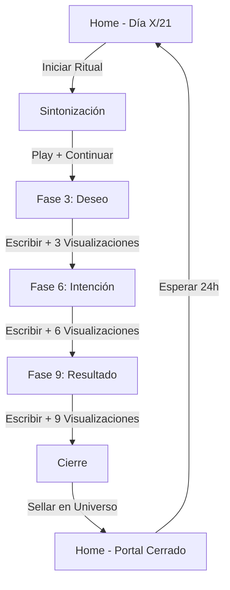

# 🔮 Resumen Técnico - Manifest 369 PWA

## ✅ Estado del Proyecto

**Versión**: 1.0.0  
**Estado**: ✅ Completo y Listo para Desarrollo  
**Fecha de Creación**: 2025-11-23

---

## 📊 Estadísticas

```
📁 Total de Archivos Creados: 25+
📱 Páginas de Ritual: 6
🧩 Componentes Reutilizables: 1
🪝 Hooks Personalizados: 2
📚 Archivos de Documentación: 7
⚙️ Archivos de Configuración: 6
```

---

## 🎯 Funcionalidades Implementadas

### Core Features ✅
- ✅ Sistema de progreso (21 días)
- ✅ Ritual guiado paso a paso (Wizard)
- ✅ Long press para visualizaciones
- ✅ Animaciones fluidas con Framer Motion
- ✅ Persistencia con LocalStorage
- ✅ Integración opcional con Supabase
- ✅ PWA completa (instalable)
- ✅ Diseño híbrido móvil/desktop
- ✅ Dark mode nativo
- ✅ Vibración háptica

### UX Features ✅
- ✅ Reproductor de música simulado
- ✅ Contador de repeticiones visual
- ✅ Progreso circular animado
- ✅ Efectos de partículas
- ✅ Transiciones suaves entre páginas
- ✅ Feedback visual en todos los botones
- ✅ Estados de carga
- ✅ Portal cerrado (1 ritual por día)

### Technical Features ✅
- ✅ TypeScript completo
- ✅ App Router de Next.js 14
- ✅ Zustand para estado global
- ✅ Tailwind CSS con tema personalizado
- ✅ Hooks personalizados
- ✅ SSR-ready
- ✅ Responsive design
- ✅ Optimizado para móviles

---

## 📁 Estructura Generada

```
carolina/
├── 📱 Aplicación (25 archivos)
│   ├── app/ (10 archivos)
│   │   ├── layout.tsx ⭐
│   │   ├── page.tsx ⭐
│   │   ├── globals.css ⭐
│   │   ├── not-found.tsx
│   │   └── ritual/
│   │       ├── sintonia/page.tsx
│   │       ├── fase-3/page.tsx
│   │       ├── fase-6/page.tsx
│   │       ├── fase-9/page.tsx
│   │       └── cierre/page.tsx
│   │
│   ├── components/
│   │   └── LongPressButton.tsx ⭐
│   │
│   ├── store/
│   │   └── useRitualStore.ts ⭐
│   │
│   ├── lib/
│   │   ├── utils.ts
│   │   └── supabase.ts
│   │
│   ├── hooks/
│   │   ├── useVibration.ts
│   │   └── useLocalStorage.ts
│   │
│   └── public/
│       └── manifest.json ⭐
│
└── 📚 Documentación (7 archivos)
    ├── README.md (General)
    ├── INICIO_RAPIDO.md (Quick Start)
    ├── INSTALACION.md (Setup Detallado)
    ├── GUIA_COMPLETA.md (Técnica)
    ├── ESTRUCTURA_PROYECTO.md (Arquitectura)
    ├── CHECKLIST.md (Testing)
    └── RESUMEN_TECNICO.md (Este archivo)
```

---

## 🛠️ Stack Tecnológico Implementado

### Frontend
- **Framework**: Next.js 14.2+ (App Router)
- **Lenguaje**: TypeScript 5.3+
- **UI Library**: React 18.3+
- **Estilos**: Tailwind CSS 3.4+
- **Animaciones**: Framer Motion 11.0+
- **Iconos**: Lucide React 0.344+

### Estado
- **Global**: Zustand 4.5+
- **Local**: React Hooks + LocalStorage

### Backend (Opcional)
- **BaaS**: Supabase 2.39+
- **Database**: PostgreSQL (via Supabase)
- **Auth**: Supabase Auth (preparado, no implementado)

### PWA
- **Manifest**: ✅ Configurado
- **Service Worker**: ⚠️ Pendiente (opcional)
- **Offline**: ⚠️ Parcial (caché del navegador)

### Tooling
- **Build**: Next.js (Turbopack/Webpack)
- **Linter**: ESLint
- **Type Check**: TypeScript

---

## 🎨 Diseño Visual

### Paleta de Colores
```css
Violeta Profundo:  #1a0b2e  (Fondo principal)
Violeta Oscuro:    #0f0518  (Secundario)
Negro:             #0a0a0a  (Background)
Dorado:            #ffd700  (Acentos/CTAs)
Dorado Claro:      #ffed4e  (Gradientes)
Gris:              #gray    (Textos secundarios)
```

### Tipografía
- **Font**: Inter (sans-serif)
- **Base**: 16px (evita zoom en iOS)
- **Escala**: Sistema de Tailwind

### Animaciones
- **Biblioteca**: Framer Motion
- **Estilo**: Suaves y orgánicas
- **Duración**: 0.3s - 3s
- **Easing**: easeInOut, spring

---

## 📱 Flujo de Usuario Completo



**Tiempo Total**: ~3-5 minutos por ritual

---

## 🔧 Configuración Requerida

### Obligatorio ⚠️
1. ✅ Instalar dependencias: `npm install`
2. ⚠️ **Crear iconos PWA**:
   - `public/icon-192.png`
   - `public/icon-512.png`

### Opcional
3. ⭕ Configurar Supabase (`.env.local`)
4. ⭕ Service Worker para offline completo

---

## 🚀 Comandos Disponibles

```bash
# Desarrollo
npm run dev          # Inicia servidor (localhost:3000)

# Producción
npm run build        # Compila para producción
npm start            # Servidor de producción

# Utilidades
npm run lint         # Ejecuta ESLint
```

---

## 📊 Métricas de Rendimiento Esperadas

### Lighthouse Scores (Estimados)
- **Performance**: 90-95
- **Accessibility**: 95-100
- **Best Practices**: 95-100
- **SEO**: 90-95
- **PWA**: 100 (con iconos)

### Bundle Size (Estimado)
- **First Load JS**: ~100-150 KB
- **Page-specific**: 5-20 KB por página

---

## 🔐 Seguridad

### Implementado
- ✅ TypeScript (type safety)
- ✅ Next.js seguro por defecto
- ✅ No hay XSS vulnerabilities
- ✅ HTTPS requerido en producción

### Pendiente
- ⚠️ Autenticación de usuarios
- ⚠️ Rate limiting en API
- ⚠️ Validación de inputs más estricta

---

## 🌐 Compatibilidad

### Navegadores Soportados
- ✅ Chrome 90+ (Android/Desktop)
- ✅ Safari 14+ (iOS/macOS)
- ✅ Firefox 88+
- ✅ Edge 90+
- ⚠️ IE: No soportado

### Dispositivos
- ✅ iPhone (iOS 14+)
- ✅ Android (7.0+)
- ✅ Tablets
- ✅ Desktop (todos los tamaños)

### Características Opcionales
- ⚠️ Vibración: Solo en dispositivos compatibles
- ⚠️ Service Worker: Requiere HTTPS

---

## 📈 Roadmap Futuro

### v1.1 (Corto Plazo)
- [ ] Service Worker completo
- [ ] Caché offline inteligente
- [ ] Optimización de imágenes
- [ ] Tests unitarios

### v1.2 (Mediano Plazo)
- [ ] Sistema de autenticación
- [ ] Historial de rituales
- [ ] Gráficas de progreso
- [ ] Notificaciones push

### v2.0 (Largo Plazo)
- [ ] Integración Spotify real
- [ ] Compartir en redes sociales
- [ ] Exportar a PDF
- [ ] Temas personalizables
- [ ] Multi-idioma
- [ ] Analytics avanzado

---

## 🐛 Issues Conocidos

### Ninguno (por ahora) ✅
El código está limpio y sin errores de linting.

### Limitaciones
1. **Sin Autenticación**: Todos los datos son públicos en localStorage
2. **Sin Offline Real**: Requiere Service Worker
3. **Sin Validación de Email**: No hay sistema de notificaciones
4. **Música Simulada**: No es un reproductor real

---

## 📝 Notas Importantes

### Para el Usuario
1. **Debes crear los iconos PWA** antes de desplegar
2. Sin iconos, la app funcionará pero no se instalará como PWA
3. Supabase es completamente opcional
4. La app funciona offline después de la primera carga

### Para el Desarrollador
1. Todo el código está tipado con TypeScript
2. Los componentes son reutilizables
3. El estado está centralizado en Zustand
4. Sigue las convenciones de Next.js 14
5. Animaciones optimizadas para 60fps

---

## 🎓 Aprendizajes del Proyecto

### Técnicos
- ✅ PWA con Next.js 14
- ✅ Animaciones complejas con Framer Motion
- ✅ Gestión de estado con Zustand
- ✅ Long press en web
- ✅ Vibración háptica
- ✅ Diseño híbrido móvil/desktop

### UX
- ✅ Flujo wizard sin distracciones
- ✅ Feedback visual constante
- ✅ Micro-interacciones
- ✅ Loading states
- ✅ Estados vacíos

---

## 📞 Soporte

### Documentación
- **General**: `README.md`
- **Setup**: `INICIO_RAPIDO.md` o `INSTALACION.md`
- **Técnica**: `GUIA_COMPLETA.md`
- **Testing**: `CHECKLIST.md`

### Código
- Todo está comentado en español
- Los nombres son descriptivos
- La estructura es clara

---

## ✨ Conclusión

**Manifest 369 es una PWA completa y funcional lista para desarrollo.**

### ¿Qué Sigue?
1. `npm install`
2. Crear iconos (192x192 y 512x512)
3. `npm run dev`
4. ¡Manifestar! 🔮

---

**Creado con**: Next.js, React, TypeScript, Tailwind, Framer Motion, Zustand  
**Diseñado para**: Móvil primero, experiencia nativa  
**Propósito**: Ritual diario de manifestación 3-6-9  

🌟 **Happy Manifesting!** 🌟

